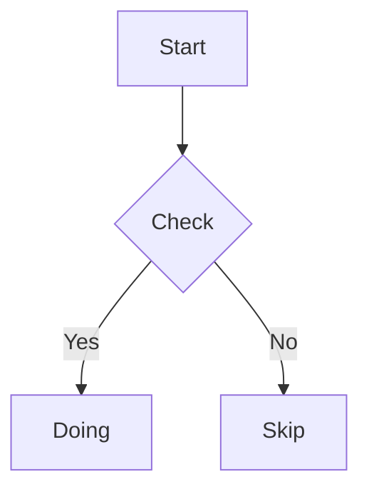

## Nullnote ver 1.2

[Nullnote v1.2 Download](https://sabanote.com/apps/)

英語に対応しました。画面の文字がすべて英語になり、日本語以外の環境でも使えます。あわせて、Markdown の中に図を描けるようになりました。文章の構成図や処理の流れを、別のツールを開かずにその場で描けます。

### 英語で使えるようになりました

- メニュー、設定、目次、検索、プレビューまで、画面の文字がすべて英語になります。
- macOS の言語設定に従うので、アプリ内での切り替え操作はありません。システム設定の「言語と地域」で、**このアプリだけ英語にする**こともできます。
- 日本語・英語を持たない言語の環境では、日本語ではなく英語が出ます。

### 図が描けるようになりました（Mermaid）

- コードブロックの言語に `mermaid` と書くと、プレビューで図として描かれます。フローチャート、シーケンス図、状態遷移図、ER図、ガントチャートなどに対応しています。

````

````

- **図の中の文字は選んでコピーできます。**画像として焼いているのではなく、生きた図として描いているためです。
- 図の右上の札を押すと、大きな窓で開きます。ピンチや `⌘`＋ホイールで拡大し、ドラッグや二本指で動かせます。**ベクタなので、どれだけ拡大しても文字が潰れません。**
- 図はアプリの中だけで描いています。外部のサービスには送りません。

### 合流の印を英語にしました

- AIなどが同じファイルを直したとき、ぶつかった箇所に入る印を `Internal updates` / `External updates` に改めました。
- 印は画面の札ではなく**書類の中身**なので、画面の言語では変わりません。英語の環境で書いた印を日本語の環境で読んでも、同じ印として扱われます。
- 1.1 までの日本語の印（`自分の更新` / `外部の更新`）も、これまでどおり印として読みます。

### 「パスをコピー」の名前を変えました

- 本文の右クリックとファイルメニューの「パスをコピー」を、**「フルパスをコピー」**に改めました。`⌥⌘C` のショートカットはそのままです。
- 「フォルダのパスをコピー」との違いが、名前だけで分かるようにしています。

### 見た目の修正

- 設定画面のチェックボックスの説明が折り返したとき、2行目が右に寄っていたのを直しました。
