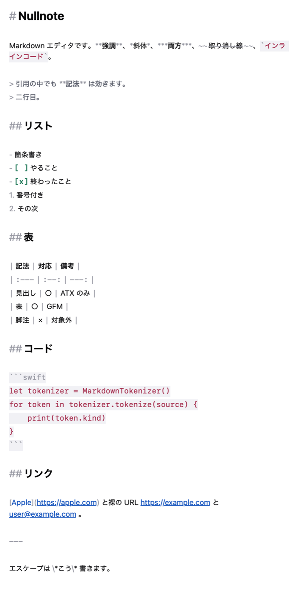
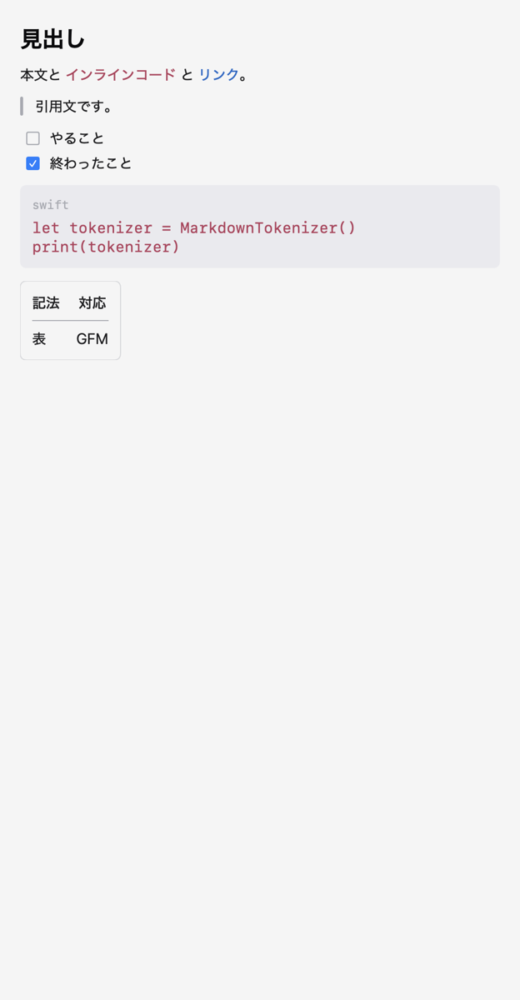

# Nullnote

macOS のための Markdown エディタ。**長い文章を書くための道具**として作っています。

 

## できること

- **記法に色が付く編集画面** — 記号は薄く、本文は読みやすく。打鍵ごとに差分だけを塗り直すので、10万字でも引っかかりません
- **プレビュー** — 表・コードブロック・引用・タスクリスト・画像。GFM 拡張に対応
- **目次** — 見出しから組み立て、クリックでその場所へ。プレビューは編集画面のスクロールに追従します
- **⌘D の複数選択** — 同じ語を次々に選んで、まとめて書き換える
- **画像の表示と配置** — `{.center}` のような指定で置き方を変えられます
- **`<!-- … -->` のコメントアウト** — プレビューにも目次にも出しません。節ごと外して下書きを残せます
- **外で書き換えられても、書きかけが消えない** — 他のエディタや AI コーディングツールが同じファイルを直したとき、重ならない部分は黙って合流し、ぶつかったところにだけ git と同じ印を入れます
- **テーマ** — システム／ライト／ダーク。OS のアクセントカラーには従わず、配色を1組に決めています

## 動かす

macOS 14 以降、Xcode 16 以降。

```sh
git clone https://github.com/osamuya/nullnote.git
cd nullnote
./Apps/Nullnote-macOS/run.sh        # ビルドして起動
./Apps/Nullnote-macOS/install.sh    # /Applications に入れる
```

Xcode で開く場合は `Apps/Nullnote-macOS/Nullnote.xcodeproj` を開き、**署名の設定で自分のチームを選んでください**（`DEVELOPMENT_TEAM` は作者のものが入っています）。

配布用の `.dmg` は準備中です。

## 作りについて

外部依存は **`apple/swift-markdown` ひとつだけ**です。それ以外はすべて標準のフレームワークで書いています。

```
Packages/MarkdownCore   記法の解析。Foundation だけに依存する
Packages/NullnoteUI     編集画面とプレビュー。SwiftUI + AppKit
Apps/Nullnote-macOS     アプリ本体（DocumentGroup）
Tools/mdmerge           外から .md を書き換えるとき、相手の直しを踏み潰さないための道具
```

**編集画面とプレビューで、パーサを分けています。** 編集画面は打鍵ごとに走るので、行単位のトークン列だけを返す自前の実装。プレビューは入れ子の構造が要るので swift-markdown。同じものを使い回すと、どちらかが遅くなるか、表現しきれなくなります。

依存は一方向です。`MarkdownCore` は UI を知らず、iOS 向けにもそのままビルドが通ります。

```sh
cd Packages/MarkdownCore && swift test   # 112 tests
cd Packages/NullnoteUI   && swift test   # 323 tests
cd Tools/mdmerge         && swift test   #   9 tests
```

## ライセンス

MIT。詳しくは [LICENSE](LICENSE) を参照してください。
