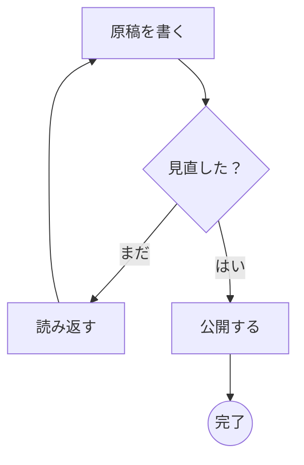
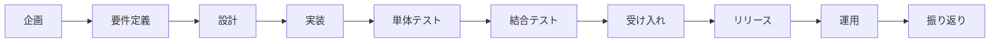
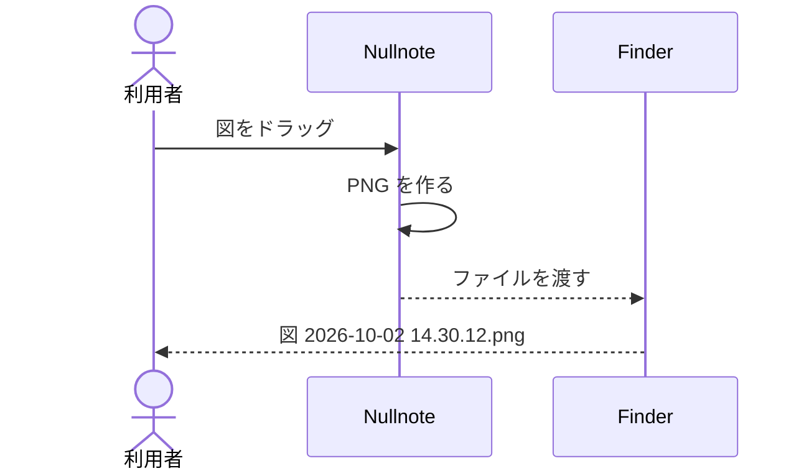
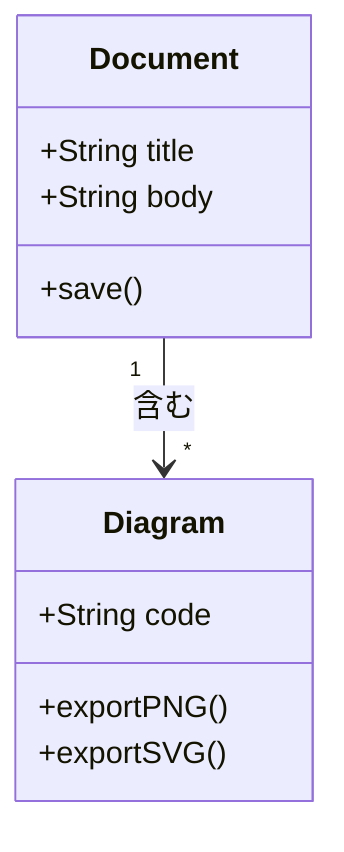
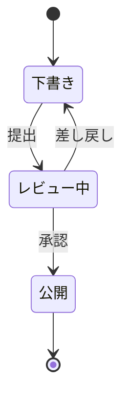
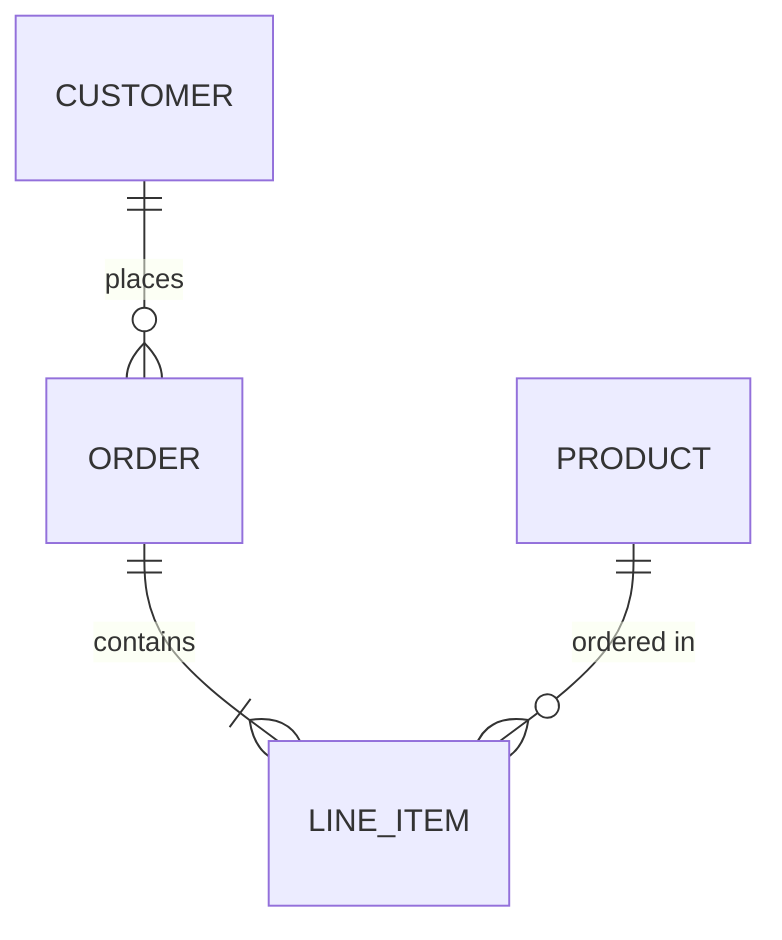
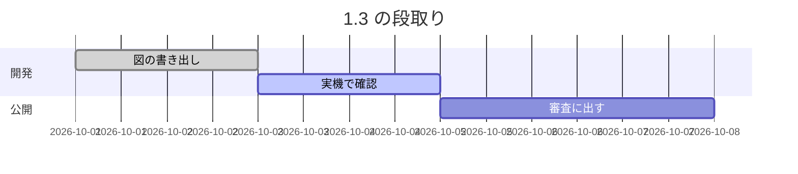
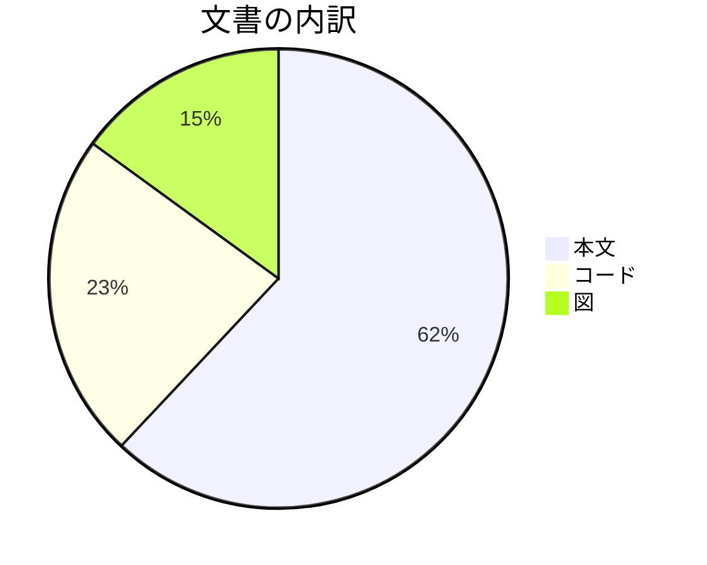
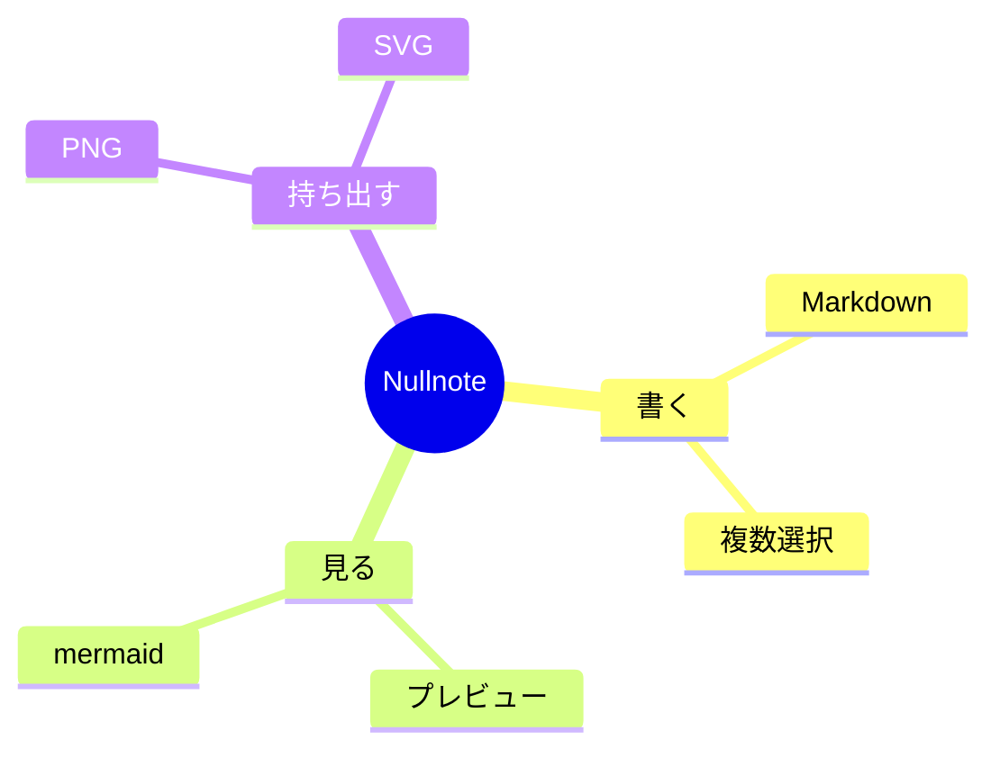
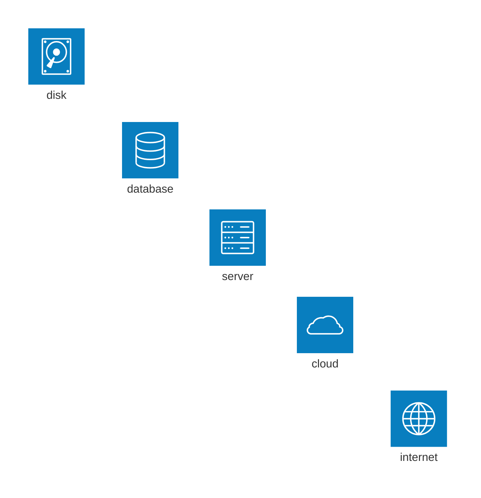

# Nullnote

Markdown エディタです。**強調**、*斜体*、***両方***、~~取り消し線~~、`インラインコード`。
[リンクのテスト](https://backlog.com/ja/blog/how-to-write-markdown/)
テキストの編集テスト
テキストの入力スピード

```
let tokenizer = MarkdownTokenizer()
for token in tokenizer.tokenize(source) {
    print(token.kind)
}
```

## Nullnote

> 引用の中でも **記法** は効きます。
> 二行目。

プレビュー側の引用句内の文字列をもう少し薄いグレイにする。

### リスト

- 箇条書き
- ~~箇条書き~~
- [ ] やること
- [x] 終わったこと
1. 番号付き
2. その次

## 表

| 記法 | 対応 | 備考 |
| :--- | :--: | ---: |
| 見出し | ○ | ATX のみ |
| 表 | ○ | GFM |
| 脚注 | × | 対象外 |

## コード

```swift
let tokenizer = MarkdownTokenizer()
for token in tokenizer.tokenize(source) {
    print(token.kind)
}
```

## リンク

[Apple](https://apple.com) と裸の URL https://example.com と user@example.com 。

### タイトルのテスト

　しかし、私はあなたに喜びを非難し、痛みを賞賛するという`この誤った考え`がどのように生まれたかを説明しなければなりません、そして私はあなたにシステムの完全な説明を与え、真実の偉大な探検家、人間の幸福のマスタービルダー。快楽そのものを拒絶したり、嫌ったり、避けたりする人は誰もいません。
　なぜなら、それは快楽だからですが、快楽を追求する方法を知らない人は、非常に苦痛な結果に合理的に遭遇するからです。それは痛みであるため、それ自体の痛みを追求または望んでいますが、時折、苦痛と痛みが彼に大きな喜びをもたらす状況が発生します。それから？しかし、迷惑な結果をもたらさない喜びを楽しむことを選択した人、または結果として生じる喜びを生み出さない痛みを回避する人との過ちを見つける権利は誰にありますか？Markdown エディタです

#### タイトルのテスト

しかし、私はあなたに喜びを非難し、痛みを賞賛するというこの誤った考えがどのように生まれたかを説明しなければなりません、そして私はあなたにシステムの完全な説明を与え、真実の偉大な探検家、人間の幸福のマスタービルダー。快楽そのものを拒絶したり、嫌ったり、避けたりする人は誰もいません。なぜなら、それは快楽だからですが、快楽を追求する方法を知らない人は、非常に苦痛な結果に合理的に遭遇するからです。それは痛みであるため、それ自体の痛みを追求または望んでいますが、時折、苦痛と痛みが彼に大きな喜びをもたらす状況が発生します。それから？しかし、迷惑な結果をもたらさない喜びを楽しむことを選択した人、または結果として生じる喜びを生み出さない痛みを回避する人との過ちを見つける権利は誰にありますか？

##### タイトルのテスト

しかし、私はあなたに喜びを非難し、痛みを賞賛するというこの誤った考えがどのように生まれたかを説明しなければなりません、そして私はあなたにシステムの完全な説明を与え、真実の偉大な探検家、人間の幸福のマスタービルダー。快楽そのものを拒絶したり、嫌ったり、避けたりする人は誰もいません。なぜなら、それは快楽だからですが、快楽を追求する方法を知らない人は、非常に苦痛な結果に合理的に遭遇するからです。それは痛みであるため、それ自体の痛みを追求または望んでいますが、時折、苦痛と痛みが彼に大きな喜びをもたらす状況が発生します。それから？しかし、迷惑な結果をもたらさない喜びを楽しむことを選択した人、または結果として生じる喜びを生み出さない痛みを回避する人との過ちを見つける権利は誰にありますか？

###### タイトルのテスト

しかし、私はあなたに喜びを非難し、痛みを賞賛するというこの誤った考えがどのように生まれたかを説明しなければなりません、そして私はあなたにシステムの完全な説明を与え、真実の偉大な探検家、人間の幸福のマスタービルダー。快楽そのものを拒絶したり、嫌ったり、避けたりする人は誰もいません。なぜなら、それは快楽だからですが、快楽を追求する方法を知らない人は、非常に苦痛な結果に合理的に遭遇するからです。それは痛みであるため、それ自体の痛みを追求または望んでいますが、時折、苦痛と痛みが彼に大きな喜びをもたらす状況が発生します。それから？しかし、迷惑な結果をもたらさない喜びを楽しむことを選択した人、または結果として生じる喜びを生み出さない痛みを回避する人との過ちを見つける権利は誰にありますか？

---
このファイルは入力速度に全く問題がない。
エスケープは \*こう\* 書く。

## mermaid の図

図の上に指を乗せると、右上に拡大の札が出ます。
**文字の外からドラッグ**すると PNG を持ち出せます。文字の上からのドラッグは選択です。

### フローチャート（縦）



### フローチャート（横に長い）

プレビューの幅より広い図は縮めて置かれます。縮んだ図でも、文字の上と外を見分けられるかの確認用。



### シーケンス図

文字を `<text>` で描く図。フローチャートとは文字の持ち方が違います。



### クラス図



### 状態遷移図



### ER 図



### ガントチャート



### 円グラフ



### マインドマップ



### 引用の中の図

> 引用の中に置いた図も描けます。
>
> ```mermaid
> flowchart LR
>     X[引用] --> Y[図]
> ```

### 描けない図

わざと書き間違えた図。図の場所に「この図は描けません」と出れば正しい動きです。

```mermaid
flowchart TB
    A[閉じていない括弧 --> B
```

